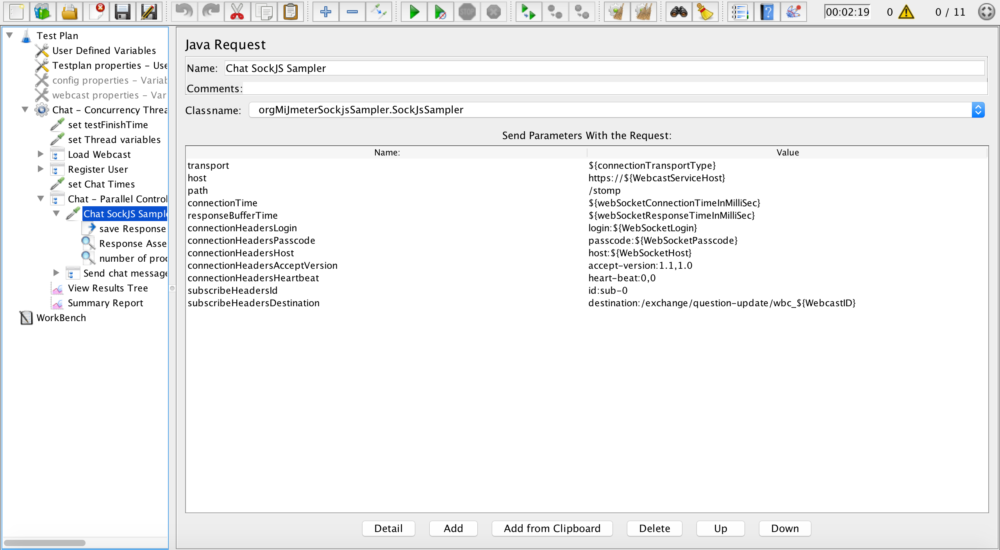
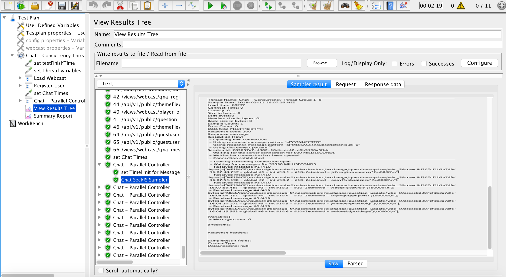

Mi Jmeter SockJS Stomp Sampler
======

Adapted from
* https://github.com/Fyro-Ing/JMeter-WebSocket-StompSampler
* https://github.com/jaysridhar/spring-websocket-client

JMeter - SockJS Stomp Sampler supporting the two transport protocols websocket and xhr-streaming

## Creating a .jar Package using Maven without any IDE (Java) and add it to JMeter
To use the sampler in your Jmeter programm you will need the compiled binary in the JMeter\lib\ext folder.

For creating the compiled binary go to the source directory of the cloned project.

After that run the following command in your terminal:

	mvn package shade:shade

This will create the org-mi-jmeter-sockjssampler-0.0.1-SNAPSHOT.jar package in the directory target.

To install this plugin put the jar file into \JMeter\lib\ext folder.

# using the Sampler in JMeter

## Add Sampler

Add a "Java Request" and choose the Classname "orgMiJmeterSockjsSampler.SockJsSampler".  

## Configure the SockJsSampler

Similarly to the HTTP Sampler the SockJsSampler needs a server address [host] and [path] to initiate a connection. Firstly JMeter sends HTTP request to the server requesting connection upgrade to the WebSocket or XHR-Streaming protocol.

By entering one of the following options "websocket" or "xhr-streaming" in the [transport] field, you can choose which protocol should be used.

When the websocket/xhr-streaming connection is successfully established the Sampler will send a STOMP CONNECT frame finishing the handshake. The STOMP CONNECT frame includes data for authentication and some special connection properties: [connectionHeadersLogin], [connectionHeadersPasscode], [connectionHeadersHost], [connectionHeadersAcceptVersion], [connectionHeadersHeartbeat].
If for any reason the confirmation is not sent from the server within the connection timeout period [connectionTime] the sampler will fail.

To receive messages after a successful connection, the Sampler must first subscribe to a destination. The Sampler will send a STOMP SUBSCRIBE frame to the server including the following properties [subscribeHeadersId] and [subscribeHeadersDestination] and registers himself. So every time, when the Server gets an message sent to the specific destination, the message gonna be send to the Sampler from the Server.

The Sampler waits for the given [responseBufferTime] for all incoming messages. After that time the sampler will return all received messages in one response.

It's possible to process that response for example via a BeanShell PostProcessor with the following code:

	vars.put("mySamplerResponse", prev.getResponseMessage());

Important fact: the connections are not shared between JMeter threads and running a test with 100 concurrent users will open 100 WebSocket/XHR-Streaming connections.
